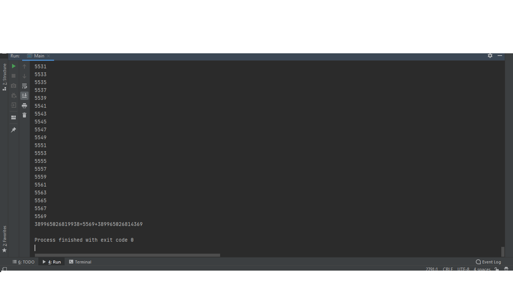
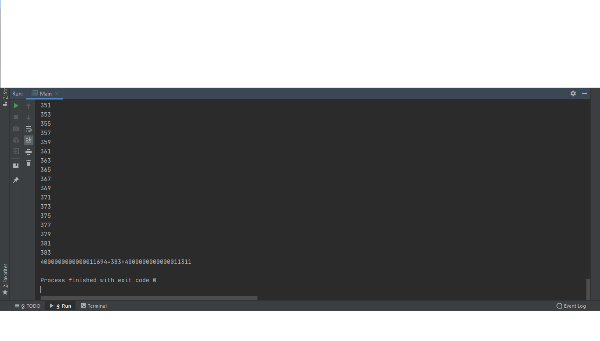

# Goldbach-conjecture-verification
The program checks the goldbach conjecture:
Every even integer greater than 2 can be expressed as the sum of two primes.
The conjecture has been shown to hold for all integers less than 4 × 10^18.
This program allows checking numbers greater than 4x10^18, but checking one number takes about half an hour.
For example:
4000000000000000000=113+3999999999999999887
4000000000000000002=211+3999999999999999791
4000000000000000004=313+3999999999999999691
4000000000000010122=419+4000000000000009703
4000000000000010910=11+4000000000000010899
4000000000000010922=23+4000000000000010899
4000000000000010968=41+4000000000000010927
4000000000000011070=17+4000000000000011053
4000000000000011694=383+4000000000000011311
4000000000000022178=5+4000000000000022173
5789438028957788126=139+5789438028957787987.
To run this program open file: Goldbach conjecture verification.exe

